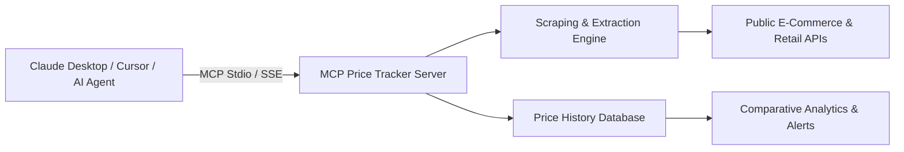

# 🏷️ MCP Price Tracker — Competitor & E-Commerce Pricing Intelligence Server

<p align="center">
  <strong>A Model Context Protocol (MCP) server for tracking public product pricing, stock availability, and competitor price movements across e-commerce platforms.</strong>
</p>

<p align="center">
  <a href="#license"></a>
  <a href="https://modelcontextprotocol.io"></a>
  <a href="https://nodejs.org"></a>
  <a href="https://www.typescriptlang.org"></a>
</p>

---

## 📌 Overview

**MCP Price Tracker** equips AI assistants (Claude Desktop, Cursor, Antigravity CLI, LibreChat) with real-time e-commerce intelligence tools via the standard **Model Context Protocol (MCP)**.

It allows language models to dynamically inspect product URLs, extract current prices, check inventory availability, compare competing merchant offers, and track historical pricing changes over time without manual browsing.

---

## 🛠️ MCP Tools & Capabilities

The server registers the following MCP tools:

| Tool Name | Parameters | Description |
| :--- | :--- | :--- |
| `get_product_price` | `url: string` | Scrapes and extracts the current price, currency, merchant, and title from a product page. |
| `check_availability` | `url: string` | Determines stock status (`in_stock`, `out_of_stock`, `backorder`, `preorder`). |
| `compare_prices` | `product_query: string`, `merchants?: string[]` | Searches across multiple merchant catalogs and returns a comparative pricing table. |
| `get_price_history` | `product_id: string`, `days?: number` | Returns historical price records and statistical low/high/average benchmarks. |
| `set_price_alert` | `product_url: string`, `target_price: number` | Configures a threshold notification when a product dips below the target price. |

---

## 🏗️ Architecture



---

## 🚀 Quick Start

### Installation

```bash
# Clone the repository
git clone https://github.com/MadanMohan0537/mcp-price-tracker.git
cd mcp-price-tracker

# Install dependencies
npm install

# Build TypeScript
npm run build
```

---

## ⚙️ MCP Client Configuration

### Claude Desktop Integration

Add the server to your `claude_desktop_config.json`:

```json
{
  "mcpServers": {
    "price-tracker": {
      "command": "node",
      "args": ["C:/Users/madan/github_repos/mcp-price-tracker/dist/index.js"]
    }
  }
}
```

### Cursor / Antigravity CLI Integration

```json
{
  "name": "price-tracker",
  "command": "node",
  "args": ["./dist/index.js"],
  "env": {}
}
```

---

## 📄 License

MIT License — see [LICENSE](LICENSE) for details.
